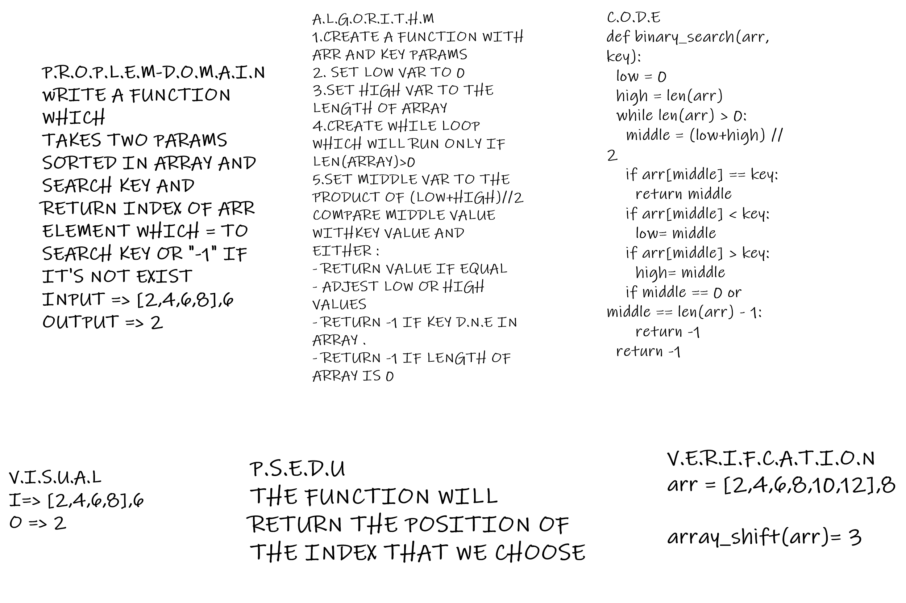

# data-structures-and-algorithms-python

# Challenge Summary
Write a function called BinarySearch which takes in 2 parameters: a sorted array and the search key. Without utilizing any of the built-in methods available to your language, return the index of the array’s element that is equal to the search key, or -1 if the element does not exist.
## Challenge Description
wRITE A FUNCTION WHICH
TAKES TWO PARAMS SORTED IN ARRAY AND SEARCH KEY AND RETURN INDEX OF ARR ELEMENT WHICH = TO SEARCH KEY OR "-1" IF IT'S NOT EXIST 
INPUT => [2,4,6,8],6
OUTPUT => 2

## Solution

https://github.com/MsDiala/data-structures-and-algorithms-python/pull/3 